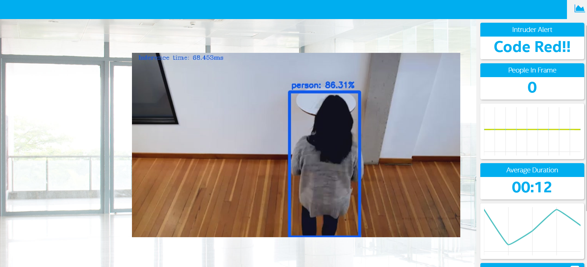

# Deploy a People Counter App at the Edge

| Details               |
| --------------------- |
| Programming Language: | Python 3.5 / 3.6 |

| Processing Requirements |
| ----------------------- |
| Min storage             | 150MB |
| RAM                     | 8GB |


## What it Does

The people counter application is a smart video IoT solution using Intel® hardware and software tools. The app will detect people in a designated area, providing the number of people in the frame, average duration of people in frame, and total count. The app will also save a copy of the streamed output to the local storage device. The people counter app includes a built-in alarm that sends an alert the user on the GUI of the app when there are more than 5 people in the video.

## How it Works

The counter will use the Inference Engine included in the Intel® Distribution of OpenVINO™ Toolkit. The model will identify people in a video frame. The app will count the number of people in the current frame, the duration that a person is in the frame (time elapsed between entering and exiting a frame) and the total count of people since the start of the video playback till the video ends or is interupted. It then sends the data to a local web server using the Paho MQTT Python package. The app also saves a copy of the streamed output to the local storage device. Thus a minimum of 150MB is recommended for smooth running of the app.

The app can take in a video of the following file formats: `.mp4`, `.webm`, `.mpg`, `.mp2`, `.mpeg`, `.mpe`, `.mpv`, `.ogg`, `.m4p`, `.m4v`, `.avi`, `.wmv`, `.mov`, `.qt`, `.flv`, `.swf`, and `.avchd`

It also works with images of these formats as input: `.jpg`, `.bmp`, `.dpx`, `.png`, `.gif`, `.webp`, `.tiff`, `.psd`, `.raw`, `.heif`, and `.indd`


## What model was used

Model Used is the tensorflow model **faster_rcnn_inception_v2_coco_2018_01_28**.
You can download the model direcly from the tensorflow model zoo by using this [link](http://download.tensorflow.org/models/object_detection/faster_rcnn_inception_v2_coco_2018_01_28.tar.gz).

## Requirements

### Hardware

- 6th to 10th generation Intel® Core™ processor with Iris® Pro graphics or Intel® HD Graphics.
- OR use of Intel® Neural Compute Stick 2 (NCS2)

### Software

- Intel® Distribution of OpenVINO™ toolkit 2019 R3 release
- Node v6.17.1
- Npm v3.10.10
- CMake
- MQTT Mosca server

## Setup

### Install Intel® Distribution of OpenVINO™ toolkit

Kindly refer to the relevant instructions for your operating system for this step.

-[Linux/Ubuntu](./linux-setup.md) -[Mac](./mac-setup.md) -[Windows](./windows-setup.md)

### Install Nodejs and its dependencies

Kindly refer to the relevant instructions for your operating system for this step.

-[Linux/Ubuntu](./linux-setup.md) -[Mac](./mac-setup.md) -[Windows](./windows-setup.md)

### Install required npm components

There are three components that need to be running in separate terminals for this application to work:

-MQTT Mosca server
-Node.js\* Web server
-FFmpeg server

From the main directory:

- For MQTT/Mosca server:

  ```bash
  cd webservice/server
  npm install
  ```

- For Web server:

  ```bash
  cd ../ui
  npm install
  ```

  **Note:** If any configuration errors occur in mosca server or Web server while using **npm install**, use the below commands:

  ```bash
  sudo npm install npm -g
  rm -rf node_modules
  npm cache clean
  npm config set registry "http://registry.npmjs.org"
  npm install
  ```

## Run the application

You'll need for separate terminals running each of the steps below to be able to use the people counter app.
Note that you'll have to setup the environment to use the Intel® Distribution of OpenVINO™ toolkit in all four of the terminals used for the app first before running through each of the steps.

### Setup the environment

You must configure the environment of each of the terminals to use the Intel® Distribution of OpenVINO™ toolkit once per session by running the following command on **Linux** or **Mac** terminal:

```bash
source /opt/intel/openvino/bin/setupvars.sh -pyver 3.5
```

and if your operating system is **windows**, you should run this in the **Windows command prompt**:

```bash
cd C:\\"Program Files (x86)"\\IntelSWTools\\openvino\\bin\\
setupvars.bat
```

or you can run **Windows command prompt** as administrator and then run this code in the shell:

```bash
C:\\"Program Files (x86)"\\IntelSWTools\\openvino\\bin\\setupvars.bat
```

NOTE: You should also be able to run the application with Python 3.6, although newer versions of Python will not work with the app.

### Starting up your app

From the main directory:

#### Step 1 - Start the Mosca server

```bash
cd webservice/server/node-server
node ./server.js
```

You should see the following message, if successful:

```bash
Mosca server started.
```

#### Step 2 - Start the GUI

Open new terminal and run commands below:

```bash
cd webservice/ui
npm run dev
```

You should see the following message in the terminal:

```bash
webpack: Compiled successfully
```

#### Step 3 - FFmpeg Server

Open new terminal and run the commands below:

```bash
sudo ffserver -f ./ffmpeg/server.conf
```

#### Step 4 - Run the code

Open a new terminal to run the code. Use the appropriate code for your operating system or device from the codes below.

#### Running on the CPU

When running Intel® Distribution of OpenVINO™ toolkit Python applications on the CPU, the CPU extension library is required. For **Linux** and **mac** users, this can be found at:

```bash
/opt/intel/openvino/deployment_tools/inference_engine/lib/intel64/
```

and for **Windows** users, the CPU extension can be found at:

```bash
C:\\"Program Files (x86)"\\IntelSWTools\\openvino\\deployment_tools\\inference_engine\\lib\\intel64\\
```

_Depending on whether you are using **Linux**, **windows** or **Mac**, the filename will be either `libcpu_extension_sse4.so` or `libcpu_extension.dylib`, respectively._ (The Linux filename may be different if you are using a AVX architecture)

Though by default application runs on CPU, this can also be explicitly specified by `-d CPU` command-line argument:

```bash
python main.py -i resources/videos/Pedestrian_Detect_2_1_1.mp4 -m model/frozen_inference_graph.xml -l /opt/intel/openvino/deployment_tools/inference_engine/lib/intel64/libcpu_extension_sse4.so -d CPU -pt 0.6 | ffmpeg -v warning -f rawvideo -pixel_format bgr24 -video_size 768x432 -framerate 24 -i - http://0.0.0.0:3004/fac.ffm
```

To see the output on a web based interface, open the link [http://0.0.0.0:3004](http://0.0.0.0:3004/) in a browser.

#### Running on the Intel® Neural Compute Stick

To run on the Intel® Neural Compute Stick, use the `-d MYRIAD` command-line argument:

```bash
python3.5 main.py -d MYRIAD -i resources/videos/Pedestrian_Detect_2_1_1.mp4 -m model/frozen_inference_graph.xml -pt 0.6 | ffmpeg -v warning -f rawvideo -pixel_format bgr24 -video_size 768x432 -framerate 24 -i - http://0.0.0.0:3004/fac.ffm
```

To see the output on a web based interface, open the link [http://0.0.0.0:3004](http://0.0.0.0:3004/) in a web browser.

**Note:** The Intel® Neural Compute Stick can only run FP16 models at this time. The model that is passed to the application, through the `-m <path_to_model>` command-line argument, must be of data type FP16.

#### Using a camera stream instead of a video file

To get the input video from the camera, use the `-i CAM` command-line argument. Specify the resolution of the camera using the `-video_size` command line argument.

For example, On **Linux** and **Mac** you write:

```bash
python main.py -i CAM -m model/frozen_inference_graph.xml -l /opt/intel/openvino/deployment_tools/inference_engine/lib/intel64/libcpu_extension_sse4.so -d CPU -pt 0.6 | ffmpeg -v warning -f rawvideo -pixel_format bgr24 -video_size 768x432 -framerate 24 -i - http://0.0.0.0:3004/fac.ffm
```

And for **Windows**:

```bash
python main.py -i CAM -m model/frozen_inference_graph.xml -l C:\\"Program Files (x86)"\\IntelSWTools\\openvino\\deployment_tools\\inference_engine\\lib\\intel64\\libcpu_extension_sse4.so -d CPU -pt 0.6 | ffmpeg -v warning -f rawvideo -pixel_format bgr24 -video_size 768x432 -framerate 24 -i - http://0.0.0.0:3004/fac.ffm
```

To see the output on a web based interface, open the link [http://0.0.0.0:3004](http://0.0.0.0:3004/) in a browser.

**Note:**
User has to give `-video_size` command line argument according to the input as it is used to specify the resolution of the video or image file.

## Screenshots of results

These are some screenshots of my results when streaming the output video:




These are the image results from when I used an image as an input:


